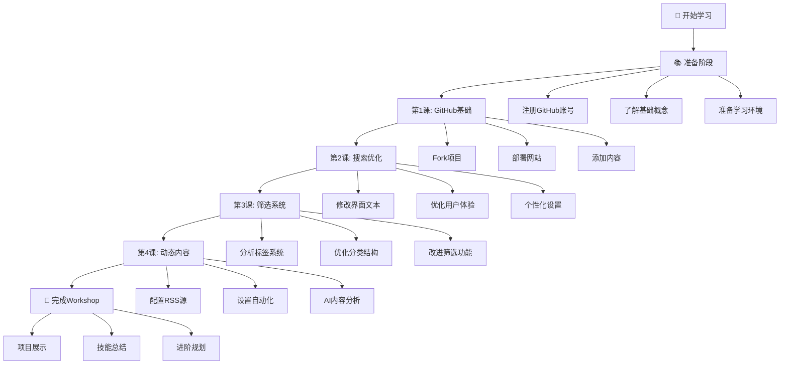

# 🗺️ Curated Gems Workshop 学习路径图

> **总体目标**：从零基础到能够独立创建和管理个人信息平台  
> **学习方式**：循序渐进，理论与实践结合  
> **核心理念**：Coding + AI + Thinking  

## 📊 学习路径总览



## 🎯 详细学习路径

### 📚 准备阶段（10分钟）

**目标**：为学习做好充分准备

**必备条件**：
- [ ] 电脑和稳定的网络连接
- [ ] 现代浏览器（Chrome、Firefox、Safari、Edge）
- [ ] 预留2小时不被打扰的学习时间

**准备任务**：
- [ ] 注册GitHub账号
- [ ] 阅读Workshop介绍
- [ ] 了解基础概念（什么是代码、网站、部署等）

**输出成果**：
- ✅ 可用的GitHub账号
- ✅ 对Workshop有基本了解

---

### 🏗️ 第1课：GitHub基础与网站部署（20-30分钟）

**学习目标**：掌握GitHub基础操作，创建第一个网站

**核心技能**：
- GitHub账号管理
- Fork操作
- GitHub Pages部署
- 基础文件编辑

**学习任务**：
- [ ] 注册并设置GitHub账号
- [ ] Fork curated-gems项目
- [ ] 启用GitHub Pages部署
- [ ] 添加第一条个人内容

**知识点**：
- 什么是版本控制
- 什么是开源项目
- 什么是网站部署
- JSON数据格式基础

**输出成果**：
- ✅ 一个可访问的个人网站
- ✅ GitHub基础操作技能
- ✅ 第一条个人内容

**验收标准**：
- [ ] 网站能正常访问
- [ ] 显示个人添加的内容
- [ ] 基础功能正常工作

**常见问题**：
- GitHub注册问题
- 部署失败问题
- 文件编辑错误

**进度指标**：25% 完成

---

### 🔍 第2课：搜索功能优化（15-20分钟）

**学习目标**：理解用户体验设计，优化界面交互

**核心技能**：
- 用户体验设计思维
- 界面文本优化
- 个性化定制

**学习任务**：
- [ ] 修改搜索框提示文本
- [ ] 优化空搜索结果提示
- [ ] 个性化来源标签显示
- [ ] 测试用户体验改进

**知识点**：
- 什么是用户体验（UX）
- 界面设计原则
- 文本优化技巧
- A/B测试概念

**输出成果**：
- ✅ 更友好的搜索界面
- ✅ 个性化的用户体验
- ✅ UX设计思维

**验收标准**：
- [ ] 搜索提示文本更友好
- [ ] 空结果提示更有帮助
- [ ] 整体体验更流畅

**进度指标**：50% 完成

---

### 🏷️ 第3课：信息分类与筛选系统（25-30分钟）

**学习目标**：掌握信息架构设计，优化分类系统

**核心技能**：
- 信息架构设计
- 标签系统优化
- 数据分析思维

**学习任务**：
- [ ] 分析现有标签问题
- [ ] 设计新的标签分类体系
- [ ] 实施标签优化方案
- [ ] 测试筛选功能改进

**知识点**：
- 什么是信息架构
- 分类学原理
- 标签系统设计
- 用户行为分析

**输出成果**：
- ✅ 优化的标签系统
- ✅ 更好的信息分类
- ✅ 信息架构思维

**验收标准**：
- [ ] 标签数量合理
- [ ] 分类逻辑清晰
- [ ] 筛选功能高效

**进度指标**：75% 完成

---

### 🤖 第4课：动态内容与AI集成（30-35分钟）

**学习目标**：掌握自动化工具，集成AI功能

**核心技能**：
- RSS数据源管理
- GitHub Actions自动化
- AI工具集成
- 系统维护

**学习任务**：
- [ ] 配置RSS数据源
- [ ] 设置GitHub Actions自动化
- [ ] 配置AI内容分析
- [ ] 测试自动更新功能

**知识点**：
- 什么是RSS
- 什么是自动化
- AI在内容处理中的应用
- 系统集成概念

**输出成果**：
- ✅ 自动更新的内容系统
- ✅ AI增强的内容分析
- ✅ 完整的信息平台

**验收标准**：
- [ ] RSS源正常工作
- [ ] 自动化流程运行
- [ ] AI分析功能正常

**进度指标**：100% 完成

---

## 📈 进度追踪系统

### 🎯 技能发展轨迹

```
编程思维发展：
零基础 ──→ 基础概念 ──→ 逻辑思维 ──→ 系统思维 ──→ 创新应用
   0%        25%         50%         75%        100%

技术技能发展：
无经验 ──→ 工具使用 ──→ 功能实现 ──→ 系统优化 ──→ 独立开发
   0%        25%         50%         75%        100%

AI应用能力：
不了解 ──→ 基础认知 ──→ 工具使用 ──→ 深度集成 ──→ 创新应用
   0%        25%         50%         75%        100%
```

### 📊 学习成果评估

#### 第1课完成后
**技术技能**：
- [ ] GitHub基础操作（注册、Fork、编辑）
- [ ] 网站部署基础
- [ ] JSON数据格式理解

**思维能力**：
- [ ] 理解代码与网站的关系
- [ ] 掌握版本控制概念
- [ ] 具备基础的问题解决思维

**实际成果**：
- [ ] 一个可访问的个人网站
- [ ] GitHub作品集开始

#### 第2课完成后
**技术技能**：
- [ ] 界面文本修改
- [ ] 用户体验优化
- [ ] 基础的前端概念

**思维能力**：
- [ ] 用户体验设计思维
- [ ] 界面优化意识
- [ ] 细节关注能力

**实际成果**：
- [ ] 个性化的用户界面
- [ ] 更好的用户体验

#### 第3课完成后
**技术技能**：
- [ ] 数据分析基础
- [ ] 信息架构设计
- [ ] 系统优化能力

**思维能力**：
- [ ] 信息分类思维
- [ ] 系统性思考能力
- [ ] 数据驱动决策

**实际成果**：
- [ ] 优化的信息分类系统
- [ ] 更高效的内容管理

#### 第4课完成后
**技术技能**：
- [ ] 自动化工具使用
- [ ] AI工具集成
- [ ] 系统维护能力

**思维能力**：
- [ ] 自动化思维
- [ ] AI应用思维
- [ ] 系统集成能力

**实际成果**：
- [ ] 完整的智能信息平台
- [ ] 自动化的内容更新系统

### 🏆 成就系统

#### 🥉 青铜成就
- **GitHub新手**：成功注册并使用GitHub
- **网站创建者**：部署第一个网站
- **内容贡献者**：添加第一条个人内容

#### 🥈 白银成就
- **体验设计师**：优化用户界面体验
- **信息架构师**：设计合理的分类系统
- **效率提升者**：显著改善系统性能

#### 🥇 黄金成就
- **自动化专家**：成功配置自动化流程
- **AI集成者**：成功集成AI功能
- **系统管理员**：独立维护完整系统

#### 💎 钻石成就
- **Workshop完成者**：完成所有课程
- **创新实践者**：在原有基础上创新功能
- **知识传播者**：帮助其他学员学习

### 📝 学习日志模板

```markdown
# 我的Workshop学习日志

## 基本信息
- 开始日期：____年__月__日
- GitHub用户名：____________
- 网站地址：https://______.github.io/curated-gems

## 学习进度

### 第1课：GitHub基础（____年__月__日）
- 开始时间：____
- 完成时间：____
- 遇到的问题：
  1. ________________
  2. ________________
- 解决方案：
  1. ________________
  2. ________________
- 主要收获：________________
- 完成状态：[ ] 已完成

### 第2课：搜索优化（____年__月__日）
- 开始时间：____
- 完成时间：____
- 遇到的问题：________________
- 解决方案：________________
- 主要收获：________________
- 完成状态：[ ] 已完成

### 第3课：筛选系统（____年__月__日）
- 开始时间：____
- 完成时间：____
- 遇到的问题：________________
- 解决方案：________________
- 主要收获：________________
- 完成状态：[ ] 已完成

### 第4课：动态内容（____年__月__日）
- 开始时间：____
- 完成时间：____
- 遇到的问题：________________
- 解决方案：________________
- 主要收获：________________
- 完成状态：[ ] 已完成

## 总结反思

### 最大的收获
________________

### 最大的挑战
________________

### 对编程的新认识
________________

### 下一步学习计划
1. ________________
2. ________________
3. ________________
```

## 🎯 学习建议

### 📅 时间安排建议

**集中学习模式**（推荐）：
- 周末连续2小时完成所有课程
- 适合注意力集中、喜欢一气呵成的学员

**分散学习模式**：
- 每天30分钟，一周完成
- 适合工作繁忙、时间碎片化的学员

**深度学习模式**：
- 每课后额外花时间深入研究
- 适合对技术有浓厚兴趣的学员

### 🧠 学习方法建议

1. **理论与实践结合**
   - 不要只看不做，一定要动手操作
   - 理解概念后立即实践应用

2. **问题驱动学习**
   - 遇到问题先自己思考
   - 尝试多种解决方案
   - 记录问题和解决过程

3. **同伴学习**
   - 和其他学员交流经验
   - 互相帮助解决问题
   - 分享学习心得

4. **反思总结**
   - 每课后总结主要收获
   - 思考如何应用到实际中
   - 规划下一步学习方向

### 🚀 进阶路径建议

**技术方向**：
- 前端开发：HTML、CSS、JavaScript深入学习
- 后端开发：Python、Node.js等服务器端技术
- 数据科学：数据分析、机器学习等

**产品方向**：
- 产品设计：用户研究、原型设计等
- 项目管理：敏捷开发、团队协作等
- 创业实践：从想法到产品的完整流程

**AI应用方向**：
- AI工具深度应用
- 自然语言处理
- 计算机视觉等专业领域

---

**记住**：学习编程不是为了成为程序员，而是为了培养解决问题的思维和能力。这个Workshop只是开始，真正的学习在于持续的实践和探索！🌟